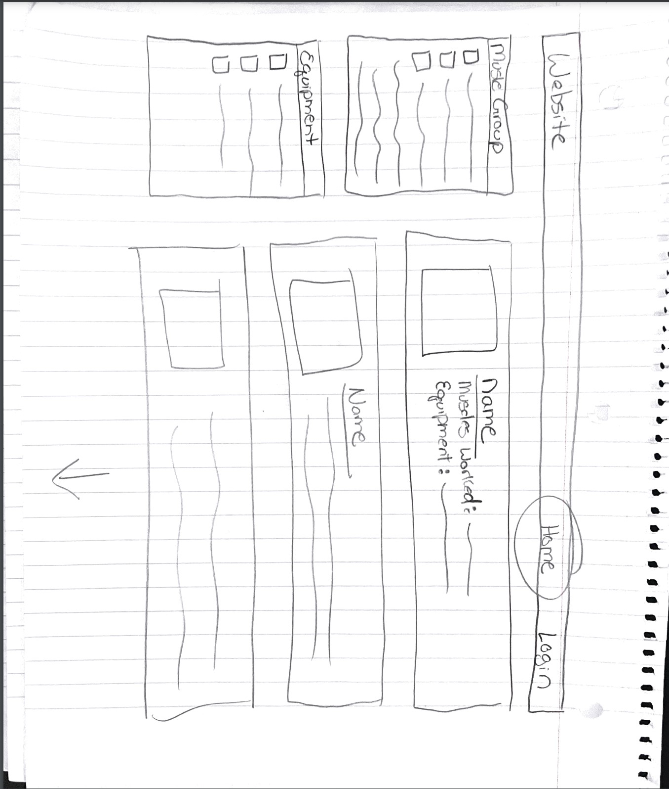
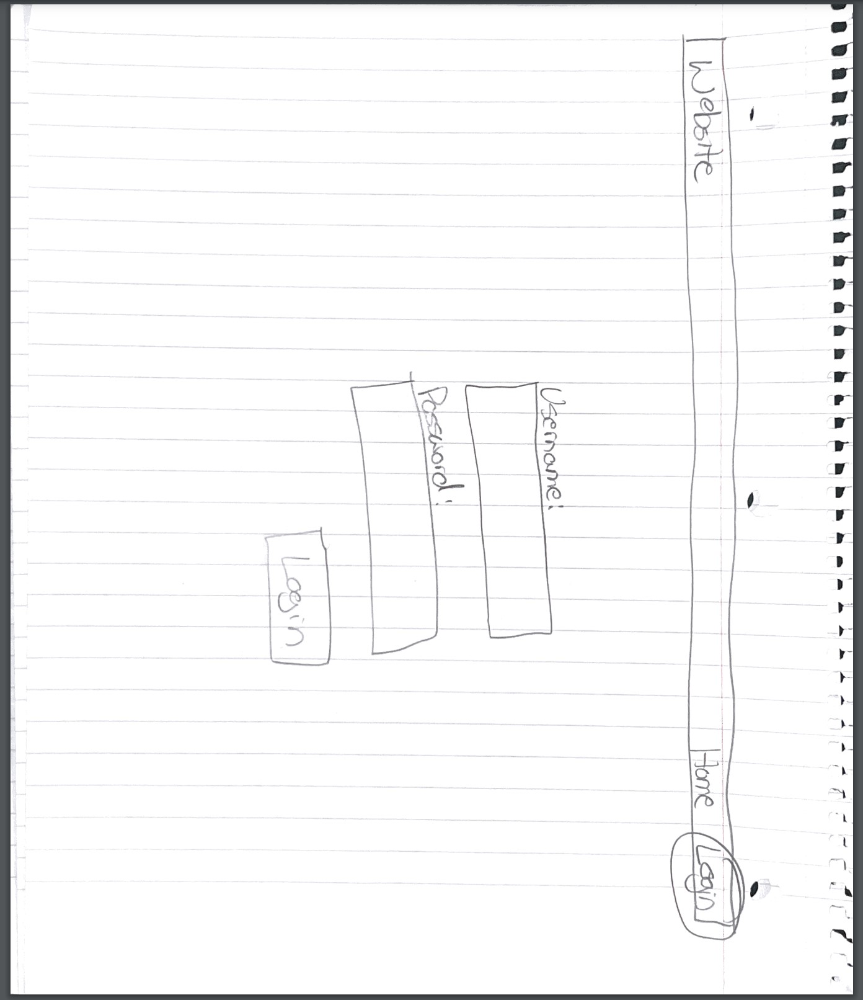
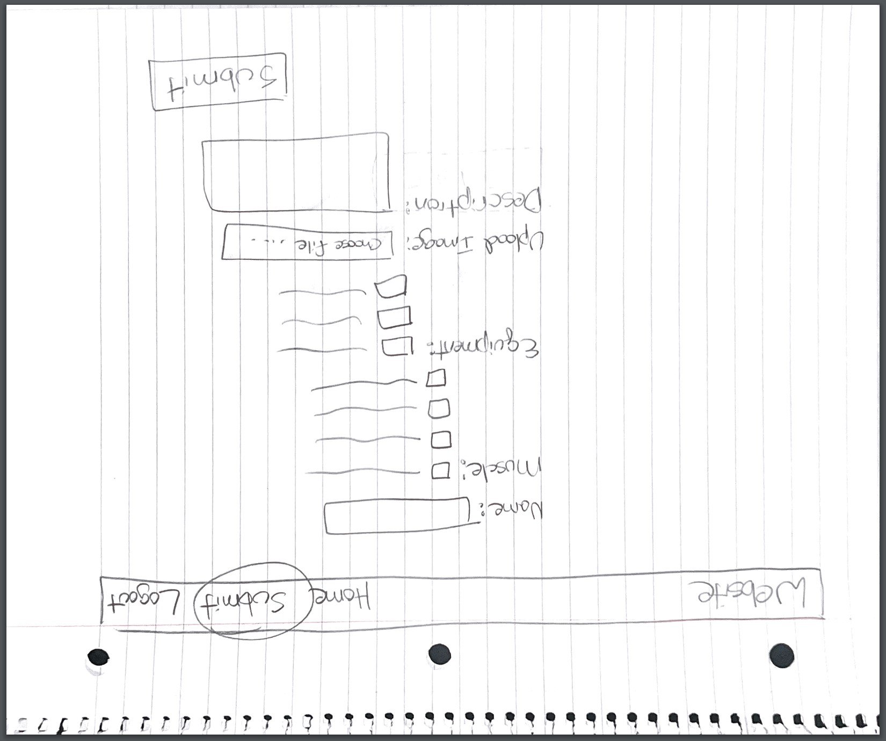
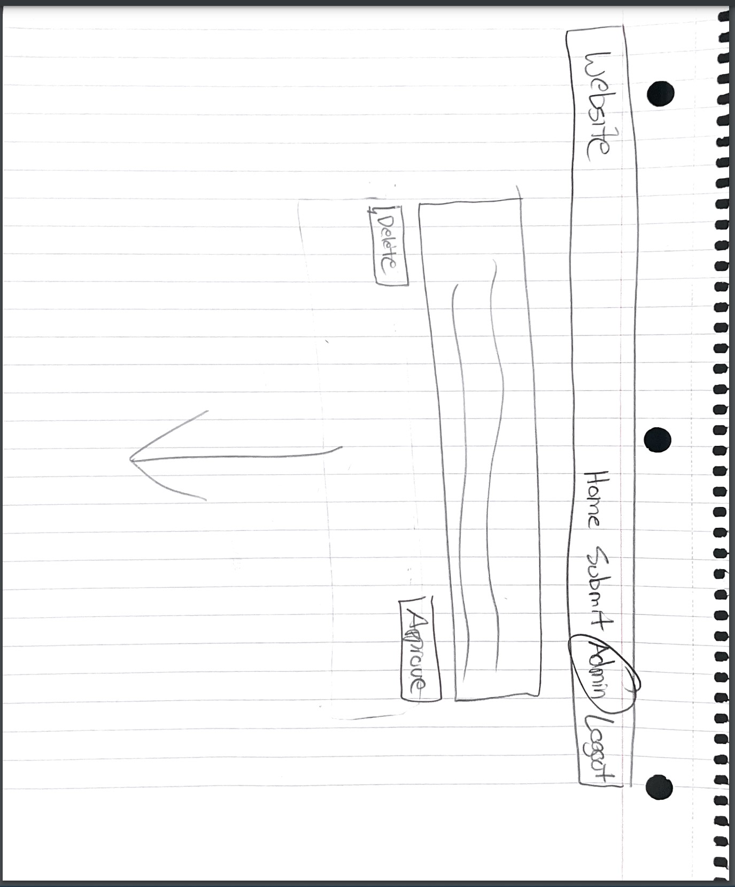
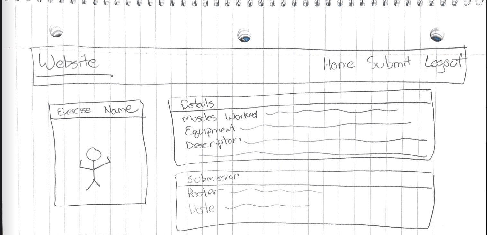

# Project 3: Design Journey

**For each milestone, complete only the sections that are labeled with that milestone.** Refine all sections before the final submission.

You are graded on your design process. If you later need to update your plan, **do not delete the original plan, rather leave it in place and append your new plan _below_ the original.** Then explain why you are changing your plan. Any time you update your plan, you're documenting your design process!

**Replace ALL _TODOs_ with your work.** (There should be no TODOs in the final submission.)

Be clear and concise in your writing. Bullets points are encouraged.

**Everything, including images, must be visible in _Markdown: Open Preview_.** If it's not visible in the Markdown preview, then we can't grade it. We also can't give you partial credit either. **Please make sure your design journey should is easy to read for the grader;** in Markdown preview the question _and_ answer should have a blank line between them.


## Design Plan (Milestone 1)

**Make the case for your decisions using concepts from class, as well as other design principles, theories, examples, and cases from outside of class (includes the design prerequisite for this course).**

You can use bullet points and lists, or full paragraphs, or a combo, whichever is appropriate. The writing should be solid draft quality.


### Catalog (Milestone 1)
> What will your catalog website be about? (1 sentence)

My catalog will be a collection of exercises tagged by (1) targeted muscle group and (2) whether or not they are machine, body weight, or free weight exercises.


### _Consumer_ Audience (Milestone 1)
> Briefly explain your site's _consumer_ audience. Your audience should be specific, but not arbitrarily specific. (1 sentence)
> Justify why this audience is a **cohesive** group. (1-2 sentences)

My site's audience will be people who are interested in starting to exercise and experienced gym-goers looking to find new exercises.

This is a cohesive audience because they have the same end goal: to find exercises that work certain muscle groups so they can accomplish their goals.


### _Consumer_ Audience Goals (Milestone 1)
> Document your _consumer_ audience's goals for using this catalog website.
> List each goal below. There is no specific number of goals required for this, but you need enough to do the job (Hint: It's more than 1. But probably not more than 3.)
> **Hint:** Users will be able to view all entries in the catalog and insert new entries into the catalog. The audience's goals should probably relate to these activities.

Goal 1: Explore a catalog of exercises

- **Design Ideas and Choices** _How will you meet those goals in your design?_
  - The website will be a catalog of browsable exercises that will be sortable by certain features to narrow down interests.
- **Rationale & Additional Notes** _Justify your decisions; additional notes._
  - Whether somebody is just starting to work out or has been doing so for a long time, a catalog of exercises can be a great place to learn the basics or find ways to make changes to your current routine.

Goal 2: Narrow down potential exercises based on the desired muscle group

- **Design Ideas and Choices** _How will you meet those goals in your design?_
  - Exercises will be tagged with body parts so that they can be sorted by "chest", "biceps", etc.
- **Rationale & Additional Notes** _Justify your decisions; additional notes._
  - A new lifter might want to know how they can be working their chest, or an experienced lifter might want to get ideas for new exercises to incorporate into their routine.

Goal 3: Narrow down exercises by available equipment

- **Design Ideas and Choices** _How will you meet those goals in your design?_
  - Allow the users to sort exercises by "machine", "free weight", and "body weight".
- **Rationale & Additional Notes** _Justify your decisions; additional notes._
  - New gym users might want to stick to workouts using bodyweight before getting a gym membership, those who do crossfit might want to sort by body weight and free weights because that is what their gyms are equipped to handle.

Goal 4: Contribute new exercises to the catalog

- **Design Ideas and Choices** _How will you meet those goals in your design?_
  - Utilizing forms, users will be able to submit new entries to the catalog.
- **Rationale & Additional Notes** _Justify your decisions; additional notes._
  - There's no possible way to categorize every piece of equipment and exercise and new ones are always being created. Therefore, it makes sense to allow users to contribute what they know to the catalog.

### _Consumer_ Audience Device (Milestone 1)
> How will your _consumer_ audience access this website? From a narrow (phone) or wide (laptop) device?
> Justify your decision. (1 sentence)

The user will access the site from a desktop computer.

Its educational nature will make it so that it will be a good resource to build programs and plan workouts, something that is usually done at home, near a desktop, rather than on-the-fly at the gym.


### _Consumer_ Persona (Milestone 1)
> Use the goals you identified above to develop a persona of your site's _consumer_ audience.
> Your persona must have a name and a face. The face can be a photo of a face or a drawing, etc.


Milhouse

**Factors that Influence Behavior:**

- Milhouse wants get bigger muscles so that Lisa will notice him, so he has decided that he's going to start working out.
- He has a general idea of what working out is supposed to look like, but he doesn't know how to target specific muscle groups or what certain machines do.

**Goals:**

- Learn about the different machines and exercises at the gym.
- Learn how to target different muscle groups.

**Obstacles:**

- He's scared to start working out in a public gym right away, so he would rather start with bodyweight exercises until he gets in better shape.

**Desires:**

- To grow his chest and biceps.


### _Administrator_ Audience (Milestone 1)
> Briefly explain your site's _administrator_ audience. Your audience should be specific, but not arbitrarily specific. (1 sentence)
> Justify why this audience is a **cohesive** group. (1-2 sentences)

The administrator audience would be the website creators and users with a history of high quality submissions.

This is a cohesive audience because they all have the same goal in mind: to continue making high value contributions to the website.


### _Administrator_ Audience Goals (Milestone 1)
> Document your _administrator_ audience's goals for using this catalog website.
> List each goal below. There is no specific number of goals required for this, but you need enough to do the job (Hint: It's more than 1. But probably not more than 3.)
> **Hint:** Users will be able to view all entries in the catalog and insert new entries into the catalog. The audience's goals should probably relate to these activities.

Goal 1: Be able to remove submissions that are no longer necessary

- **Design Ideas and Choices** _How will you meet those goals in your design?_
  - Provide a "delete" button for administrators to get rid of low quality submissions.
- **Rationale & Additional Notes** _Justify your decisions; additional notes._
  - The direction of the website may change, or something may be found to be incorrect, so administrators should be able to remove things from the catalog.

Goal 2: Ensure user submissions are appropriate before they go live

- **Design Ideas and Choices** _How will you meet those goals in your design?_
  - User submitted exercises do not immediately appear on the site. There will be an admin page where all user submissions appear and can be approved by admins. This can be done with a column in the DB table for "approved" with a true/false value. Only exercises with "true" values will display on the live site.
- **Rationale & Additional Notes** _Justify your decisions; additional notes._
  - Users can post inappropriate or incorrect content on the website if allowed to freely submit exercises.


### _Administrator_ Persona (Milestone 1)
> Use the goals you identified above to develop a persona of your site's _administrator_ audience.
> Your persona must have a name and a face. The face can be a photo of a face or a drawing, etc.


Chris

**Factors that Influence Behavior:**

Chris is a web design student that is passionate about working out. He wants to create a website where new lifters can explore different exercises and experienced lifters can find new ways to change up their routines. Since there is a never ending amount of exercises and routines, he has chosen to allow user submissions on the website.

**Goals:**

- Create and maintain a website where users can submit and review different exercises.

**Obstacles:**

- Since the fitness world is ever-changing, he'll have to be able to delete outdated entries.
- Internet users are known to be malicious without good reason, so he'll have to control what submissions are posted for the public to see.

**Desires:**

- Provide a clean easy to use website.
- Ensure that appropriate and high quality content is posted to the site.


### Catalog Data (Milestone 1)
> Using your personas, identify the data you need to include in the catalog for your site's audiences.
> Justify why this data aligns with your persona's goals. (1 sentence)

The website will need to be a catalog of gym exercises that can be sorted by equipment type and the targeted muscle.

This allows the users to research and find new/different exercises in an efficient manner,


### Site Design (Milestone 1)
> Design your catalog website to address the goals of your personas.
> Sketch your site's design:
>
> - These are **design** sketches, not _planning_ sketches.
> - Use text in the sketches to help us understand your design.
> - Where the content of the text is unimportant, you may use squiggly lines for text.
> - **Do not label HTML elements or annotate CSS classes.** This is not a planning sketch.
>
> Provide a brief explanation _underneath_ each sketch. (1 sentence)
> **Refer to your persona by name in each explanation.**


The home page is the catalog page. It will list all of the submitted exercises for Milhouse and have options to sort them by required equipment and muscle group. The only option on the navigation bar when not logged in will be "login".

The login page is a straight-forward login page with username and password fields, that way there's no confusion for Milhouse since he'll be used to standard login pages.

The submission page will appear in the navigation bar when logged in. It will be a form with all of the fields required to submit an exercise. If Milhouse ever gets the hang of working out, he can make his own contributions here.

The admin panel will be all of the submitted exercises that haven't yet been approved by Chris. It will give the him the option to approve or delete the submissions based upon his judgement.

The details page will give the user (Milhouse) more information about the individual exercise they have clicked on, specifically, a description and a larger image of the exercise being completed. Will potentially contain a comments section for other users once sessions have been implemented.
MODIFIED (4/25): No longer intending to include comments section under details, time constraints for project submission.


### Catalog Design Patterns (Milestone 1)
> Explain how you used design patterns in your site's design. (1-2 sentences)

The catalog page and sorting uses common web design practices - anybody who has used Amazon or a similar site will be able to interact with it intuitively.
The submission form uses best design practices by pulling the reader's eyes from left to right and down the form.
The login page is standard design practice for a login page.
The admin page is similar to the catalog page because of the ease with which it can be navigated using this style. Simple "approve" and "delete" buttons will make it easy to interact.


## Implementation Plan (Milestone 1, Milestone 2, Milestone 3, Final Submission)

### Database Schema (Milestone 1)
> Plan the structure of your database. You may use words or a picture.
> A bulleted list is probably the simplest way to do this.
> Make sure you include constraints for each field.

Table: Exercises (Modified on 4/25 IAW milestone feedback to include images table in entries)

- id: integer, not null, auto incrementing, primary key
- name: text, not null
- description: text, not null
- submitted_by: text, not null
- date_submitted: text, not null
- file_name: text, not null
- file_ext: text, not null
- file_source: text
- approved: integer, not null

Table: Tags

- id: integer, not null, auto incrementing, primary key
- tag: text, not null

Table: Exercise_Muscle_Tags

- id: integer, not null, auto incrementing, primary key
- exercise: integer, not null (Foreign Key -> exercises.id)
- tag: integer, not null (Foreign Key -> tags.id)

Table: Exercise_Equipment_Tags

- id: integer, not null, auto incrementing, primary key
- exercise: integer, not null (Foreign Key -> exercises.id)
- tag: integer, not null (Foreign Key -> tags.id)


### Database Query Plan (Milestone 1, Milestone 2, Milestone 3, Final Submission)
> Plan _all_ of your database queries.
> You may use natural language, pseudocode, or SQL.

```
Querying the catalog: will display the entire exercise catalog where approved = 1. Approved = 1 will mean that the submission has been viewed by an admin and approved for site use within the admin panel. Query can be modified using tags (WHERE tag = #) to display certain entries.
```

```
Querying the admin panel: will display the entire exercise catalog where approved = 0. Approved = 0 will mean it is a fresh submission that has not yet been viewed.
```

```
Querying the details page: will display all of the information about the exercise on which the "details" button was clicked in the catalog. Will use "exercises.name" field from the click to accomplish this, since it was already included in that query and is unique/not null for every exercises.
MODIFIED (4/25 IAW Feedback): Details page will display all of the information of a given exercise utilizing the post request in the URL.
```

## Complete & Polished Website (Final Submission)

### Accessibility Audit (Final Submission)
> Tell us what issues you discovered during your accessibility audit.
> What do you do to improve the accessibility of your site?

- lacked alternative text for catalog images: I echo'd the image name after "this is a picture of a..." as an alt text for every image.
- duplicate labels for "all" tag on equipment/muscle groups: I further specified them as "allmuscles" and "allequipment"
- lacked labels for radio buttons: I had a " " before the label's "for" so I wasn't echo'ing the right value
- HTML validator: cleaned up missing <div></div> and syntax errors


### Self-Reflection (Final Submission)
> Reflect on what you learned during this assignment. How have you improved from Projects 1 and 2?

I am infinitely more comfortable applying the methods from project 1 and 2 and feel fairly confident in my ability to apply any new material learned for project 3. I wish the timeline of the course had been different, so I would have had more time to expand upon user accounts for the sake of advanced features like comments.


> Take some time here to reflect on how much you've learned since you started this class. It's often easy to ignore our own progress. Take a moment and think about your accomplishments in this class. Hopefully you'll recognize that you've accomplished a lot and that you should be very proud of those accomplishments! (1-3 sentences)

Prior to starting this class I had very limited experience with server-sided web development. Now, I feel confident that I can create most things or follow online tutorials for things I don't yet understand since I feel like this class gave a strong foundation for further learning.


### Collaborators (Final Submission)
> List any persons you collaborated with on this project.

I did not collaborate with anybody.


### Reference Resources (Final Submission)
> Please cite any external resources you referenced in the creation of your project.
> (i.e. W3Schools, StackOverflow, Mozilla, etc.)

StackOverflow, especially for referencing errors in SQL queries. PHP documentation.


### Grading: User Accounts (Final Submission)
> The graders will need to log in to your website.
> Please provide the usernames and passwords.

**Administrator User:**

- Username: Chris
- Password: monkey

**Consumer User:**

- Username: User
- Password: monkey

**Note:** Not all websites will support consumer log in. If your website doesn't, say so.


### Grading: Step-by-Step Instructions (Final Submission)
> Write step-by-step instructions for the graders.
> The project if very hard to grade if we don't understand how your site works.
> For example, you must log in before you can delete.
> For each set of instructions, assume the grader is starting from /

_View all entries:_

1. Navigate to the home page. By default, all entries are displayed.

_View all entries for a tag:_

1. On the left hand side of the home page there's radio buttons that correspond to equipment and muscle tags. They can be clicked in any combination of one muscle and one equipment style at a time.
2. You can also view "all muscles" with one equipment type, or "all equipment" on one muscle type.

_View a single entry's details:_

1. Navigate to the home page.
2. Hover over any individual entry. The catalog item will expand when hovered over.
3. Click the entry. It will navigate you to a details page specific to that entry.

_How to insert and upload a new entry:_

1. You must first sign in as any user, admin or otherwise. Use the login button in the nav bar. (Possible login: User, monkey)
2. Navigate to the "submit" page in the navigation bar. This will not appear if you are not logged in.
3. There is a form to submit a new entry. All items within the form must be filled out except for "image source". Click "submit".
4. This entry does not display on the live website upon submission - it must first be approved by an administrator.
5. TO APPROVE FOR VIEWING ON THE LIVE WEBSITE...
6. Login as an administrator user (Login: Chris, monkey)
7. Navigate to the "admin panel" page in the navigation bar. This will not appear for regular users.
8. This page will display a list of pending entries, or be blank if there are no entries waiting for approval/denial.
9. On every entry, there will be an "approve" button and a "delete" button. Clicking "approve" will display the entry on the live website, directly accessible via the home page.

_How to delete an entry:_

1. Login as an administrator user (Login: Chris, monkey) using the login button in the navbar.
2. Click on "admin panel" to view pending user submissions
3. All entries not yet approved by an admin will be displayed here, the page will be blank if there are none.
4. To delete an entry, click the "delete" button. This will delete the unapproved entry from the main table and corresponding tags table, in addition to deleting the corresponding uploaded image.
